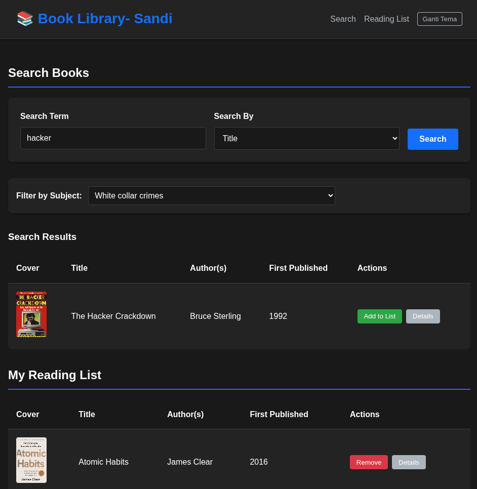
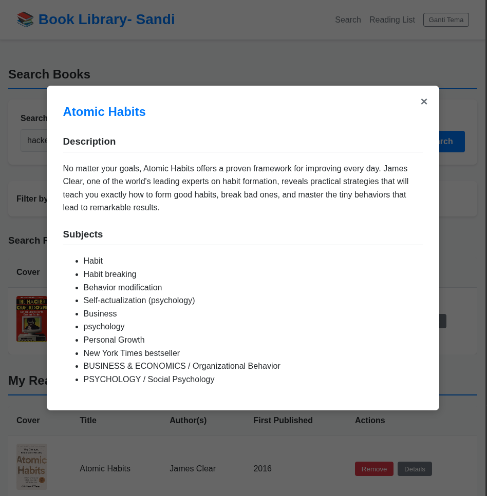

# 📚 UTS Pemrograman Web — Book Library App

Aplikasi ini merupakan tugas **UTS Pemrograman Web** yang dikembangkan menggunakan **React + Vite** dan **Open Library API**.
Aplikasi berfungsi untuk **mencari buku, melihat detail, dan menyimpan daftar bacaan (Reading List)** secara lokal.

---

## 👤 Identitas Pengembang

| Nama                    | NIM           |
| ----------------------- | ------------- |
| **Riyan Sandi Prayoga** | **123140176** |

---

## 🌐 Link Deployment (Vercel)

Aplikasi dapat diakses secara online melalui link berikut:

🔗 **[https://uts-pemweb-123140176.vercel.app](https://uts-pemweb-123140176.vercel.app)**

> ✅ Deployment menggunakan **Vercel** dan sudah diuji pada perangkat **mobile & desktop**.

---

## ✨ Fitur Utama

✅ **Pencarian Buku** — Berdasarkan **judul** atau **penulis**.
✅ **Hasil Pencarian Interaktif** — Menampilkan *cover*, *judul*, *penulis*, dan *tahun terbit*.
✅ **Detail Buku** — Menampilkan *deskripsi* dan *subjek buku*.
✅ **Reading List (LocalStorage)** — Menyimpan buku favorit secara lokal tanpa login.
✅ **Filter Berdasarkan Subjek** — Menyaring hasil agar lebih relevan.
✅ **Tema Gelap & Terang (Dark Mode Toggle)**.
✅ **Desain Responsif** — Optimal di layar desktop dan mobile.

---

## 🧠 Validasi & Pengujian

| Aspek                | Status | Keterangan                                                                                               |
| -------------------- | ------ | -------------------------------------------------------------------------------------------------------- |
| Form validation      | ✅      | Input pencarian tidak boleh kosong                                                                       |
| API Integration      | ✅      | Menggunakan [Open Library API](https://openlibrary.org/developers/api) dengan penanganan error & loading |
| Responsiveness       | ✅      | Sudah diuji pada resolusi mobile & desktop                                                               |
| Deployment           | ✅      | Menggunakan Vercel                                                                                       |
| Clean code           | ✅      | Struktur rapi, indentasi konsisten, dan konvensi penamaan sesuai                                         |
| Environment variable | ✅      | Tidak ada hardcoded API key                                                                              |

---

## 🛠️ Instalasi Lokal

1. Clone repository ini:

   ```bash
   git clone https://github.com/404S4ND1/UTS-PEMWEB-123140176.git
   ```
2. Masuk ke folder project:

   ```bash
   cd UTS-PEMWEB-123140176
   ```
3. Install semua dependensi:

   ```bash
   npm install
   ```
4. Jalankan aplikasi di mode development:

   ```bash
   npm run dev
   ```
5. Buka di browser: [http://localhost:5173](http://localhost:5173)

---

## 🧹 Struktur Folder

```
UTS-PEMWEB-123140176/
│
├── src/
│   ├── components/
│   │   ├── SearchBar.jsx
│   │   ├── BookList.jsx
│   │   ├── BookDetail.jsx
│   │   └── ReadingList.jsx
│   ├── App.jsx
│   └── main.jsx
│
├── public/
├── package.json
├── vite.config.js
└── README.md
```

---

## 📷 Screenshot Aplikasi

> 
> *Deskripsi: Menunjukkan Home*

> 
>  *Deskripsi: Menunjukkan Tmpilan dark mode.*

> 
>  *Deskripsi: Menunjukkan fitur detail buku.*

---

## 📊 Commit History (Progress)

Project ini dikembangkan secara bertahap dengan minimal **10 commit bermakna**, seperti:

* `add: fitur pencarian buku`
* `fix: validasi input kosong`
* `update: mode gelap/terang`
* `deploy: konfigurasi vercel.json`

---

## 💬 Catatan Tambahan

* Aplikasi tidak menggunakan **API key** (karena Open Library API bersifat publik).
* Semua data bersifat sementara dan disimpan di **LocalStorage**.
* Jika ingin menambahkan fitur lanjutan seperti pagination atau favorit berbasis akun, gunakan backend API tambahan.

---

## 🧑‍💻 Teknologi yang Digunakan

| Kategori           | Teknologi                 |
| ------------------ | ------------------------- |
| Framework Frontend | React + Vite              |
| Styling            | CSS Modules / TailwindCSS |
| API                | Open Library API          |
| Deployment         | Vercel                    |
| Penyimpanan Lokal  | LocalStorage              |

---

### 📌 Lisensi

Project ini bersifat **open-source** untuk keperluan pembelajaran.

---

> 🚀 *Dikembangkan dengan semangat belajar dan eksplorasi oleh*
> **Riyan Sandi Prayoga (123140176)** 💡
